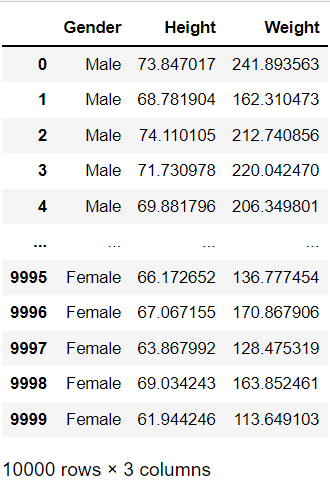
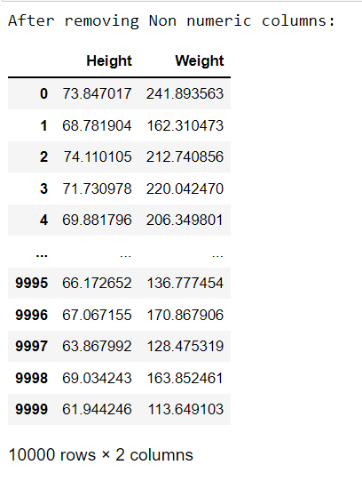
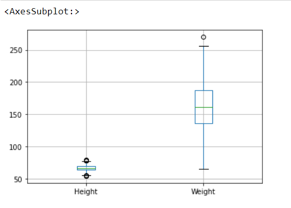
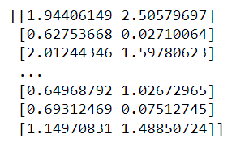
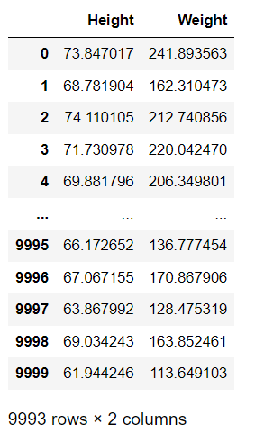
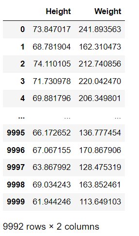
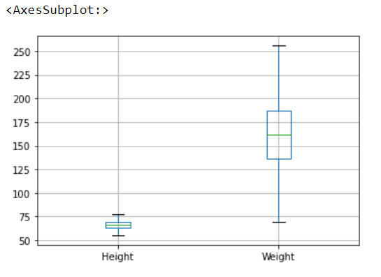
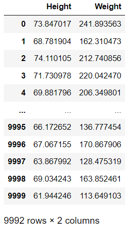

# Ex-02_DS_Outlier
Ex-02_DS_Outlier
## AIM
To detect and remove the outliers in the given data set and save the final data.

# ALGORITHM
# Step 1
Import the required packages(pandas,numpy,scipy)

# Step 2
Read the given csv file

# Step 3
Convert the file into a dataframe and get information of the data.

# Step 4
Remove the non numerical data columns using drop() method.

# Step 5
Detect the outliers in the data set using z scores method.

# Step 6
Remove the outliers by z scores and list manupilation or by using Interquartile Range(IQR)

# Step 7
Check if the outliersare removed from data set using graphical methods.

# Step 8
Save the final data set into the file.

# CODE:
~~~
Developed By: NAVEENKUMAR V
Register No: 212221230068
import pandas as pd
df=pd.read_csv('weight.csv')
df
df=df.drop("Gender",axis=1)
print('After removing Non numeric columns:')
df
df.boxplot()
import numpy as np
from scipy import stats
z=np.abs(stats.zscore(df))
print(z)
df1=df.copy()
df1=df1[(z<3).all(axis=1)]
df1
df1.boxplot()
df2=df.copy()
q1=df2.quantile(0.25)
q3=df2.quantile(0.75)
IQR=q3-q1
df_new=df2[((df2>=q1-1.5*IQR)&(df2<=q3+1.5*IQR)).all(axis=1)]
df_new
df_new.boxplot()
df_new
df.to_csv('weight.csv', index=False)
~~~
# OUTPUT:
# Initial data set:

# Data set after removing non numerical sets:

# Graph displaying initial dataset with outliers:

# Z scores to detect outliers:

# Data set after removing outliers in weight using z scores and list manupilation:

# Graph after removing outliers in weight:

# Data set after removing outliers in height using Interquartile Range(IQR):

# Final graph after removing all outliers:

# Final data set:

# RESULT:
Thus the outliers are detected and removed in the given file and the final data set is saved into the file.
